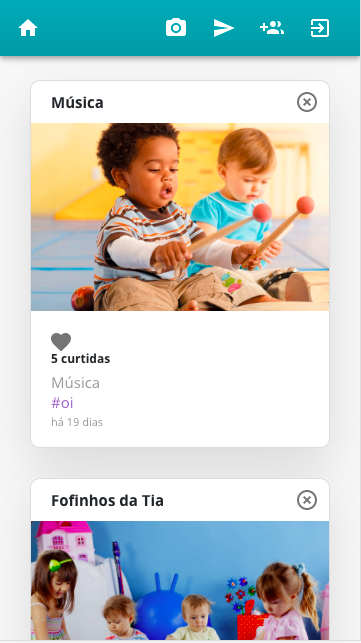
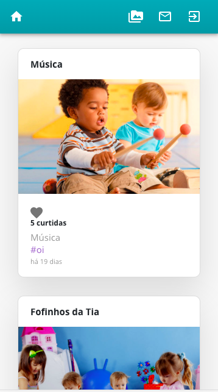
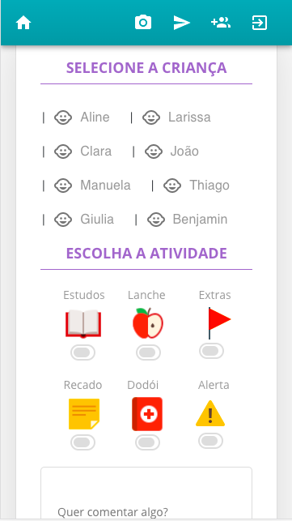
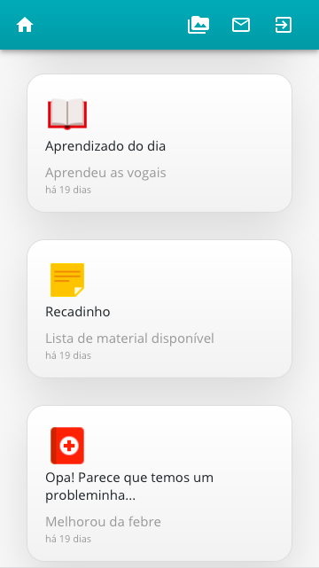

# Final Project - Funny Class  

> "Funny Class" is an application for daycare centre and preschools to share children's routines with parents.  

> This app is build in React.js, Node.js, Javascript, MongoDB, Socket.io, Express, HTML, CSS, Axios, Bootstrap, Express, Cors, Material UI, Passport and more - Beta version 1.0.0.  

## Instructions to use the app:

* The school will provide username and password for parents access to the app.

## Some app screens:

* Teacher main interface

* Parents main interface

* Teacher interface for add post unique

* Parents interface of post unique 

## App link

https://funnyclass.herokuapp.com/
